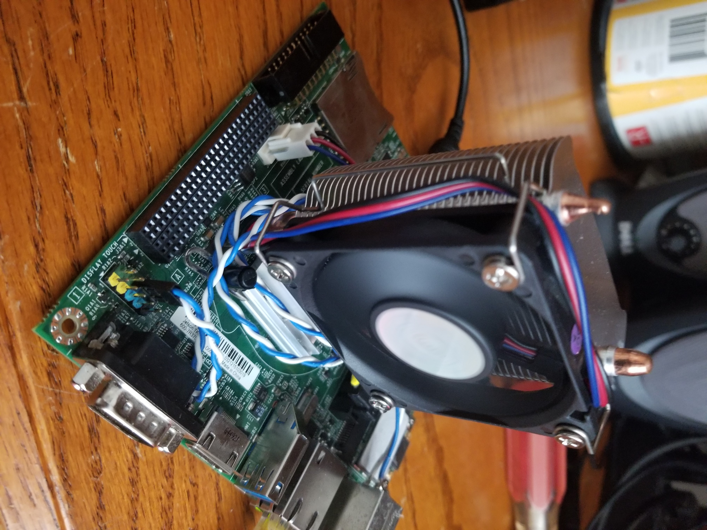

## How to install Minecraft on the Tegra Jetson K1

### Forewarning

Much of this code shown off in this article I take no responsibility for except for the organization of it. This tutorial includes many snippets of tutorial from other people and will be linked in accordingly. This tutorial is being made for ease of use and to have every tutorial in one place.


### Overclocking

This part is optional. This does void the Jetson's warranty and has the possibility to damage your system. By using this modified kernel, you will be able to achieve a 2.79GHz clockspeed on the CPU and an over 1Ghz clockspeed on the GK20A Kepler GPU. Third party cooling is **highly recommended**. I have used a cheap Evercool Northbridge cooler (See picture) but any reasonable other northbridge cooler should be sufficient.


First, download my custom compiled kernel at 

```markdown
Syntax highlighted code block

# Header 1
## Header 2
### Header 3

- Bulleted
- List

1. Numbered
2. List

**Bold** and _Italic_ and `Code` text

[Link](url) and 
```

For more details see [GitHub Flavored Markdown](https://guides.github.com/features/mastering-markdown/).

### Jekyll Themes

Your Pages site will use the layout and styles from the Jekyll theme you have selected in your [repository settings](https://github.com/billybobpickle/billybobpickle.github.io/settings). The name of this theme is saved in the Jekyll `_config.yml` configuration file.

### Support or Contact

Having trouble with Pages? Check out our [documentation](https://help.github.com/categories/github-pages-basics/) or [contact support](https://github.com/contact) and we’ll help you sort it out.

