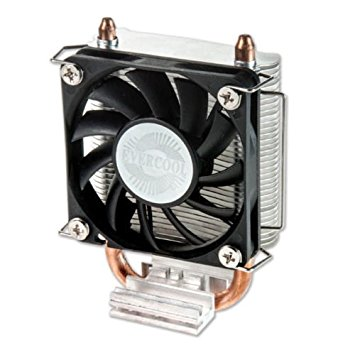

## How to install Minecraft on the Tegra Jetson K1

### Forewarning

Much of this code shown off in this article I take no responsibility for except for the organization of it. This tutorial includes many snippets of tutorial from other people and will be linked in accordingly. This tutorial is being made for ease of use and to have every tutorial in one place.


### Overclocking

This part is optional. This does void the Jetson's warranty and has the possibility to damage your system. By using this modified kernel, you will be able to achieve a 2.79GHz clockspeed on the CPU and an over 1Ghz clockspeed on the GK20A Kepler GPU. Third party cooling is **highly recommended**. I have used a cheap Evercool Northbridge cooler (See picture) but any reasonable other northbridge cooler should be sufficient.


First, download my custom compiled kernel named [zImageOC2](zImageOC2) Copy that file to the /boot directory then open up /boot/extlinux/extlinux.conf with root permissions using the text editor of your choosing. Look for:
```markdown
LINUX /boot/zImage
```
and change it to 
```markdown
LINUX /boot/zImageOC2
```
Then go to the /home/ubuntu directory and edit with root permissions the .bashrc file. Add the following lines to the beginning of the file:
```markdown
echo 0 > /sys/devices/system/cpu/cpuquiet/tegra_cpuquiet/enable
echo 1 > /sys/devices/system/cpu/cpu0/online
echo 1 > /sys/devices/system/cpu/cpu1/online
echo 1 > /sys/devices/system/cpu/cpu2/online
echo 1 > /sys/devices/system/cpu/cpu3/online
echo performance > /sys/devices/system/cpu/cpu0/cpufreq/scaling_governor
```


